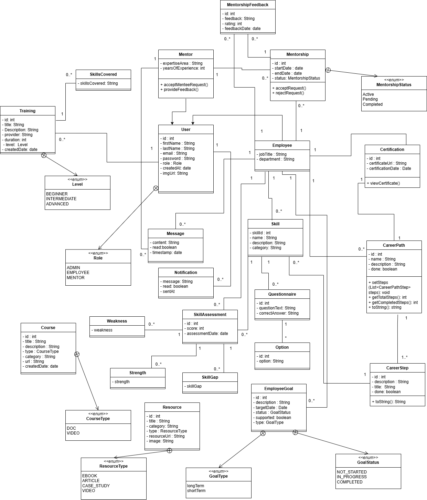
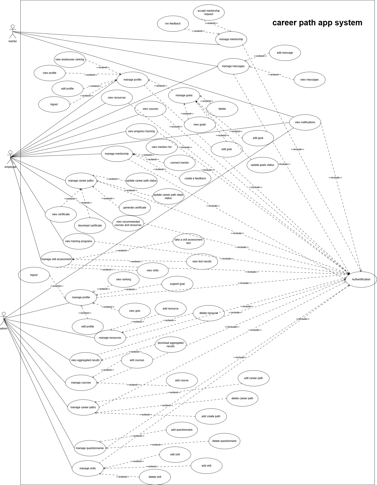
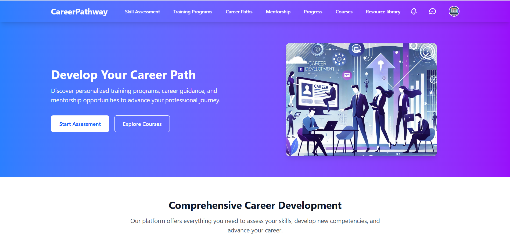

## 📌 Jira Planification  
🔗 [Accéder au backlog Jira](https://khadja-ourraiss.atlassian.net/jira/software/projects/CPW/boards/20/backlog?atlOrigin=eyJpIjoiY2ViNTc4YmJjODIyNGJhYzhhMGViOWQxNDFlMjU0OTciLCJwIjoiaiJ9)  

## 📂 UML Class Diagram  
🖼️ [Voir le diagramme UML dans drawio](https://drive.google.com/file/d/136YjdoE2QA3aa39QYP999r8cv9Hkr0BO/view?usp=sharing)



## 📂 UML Use Case Diagram
🖼️ [Voir le diagramme UML dans drawio](https://app.diagrams.net/?src=about#G136YjdoE2QA3aa39QYP999r8cv9Hkr0BO#%7B%22pageId%22%3A%22UmO6fCnqPAWRrfg_ZkGU%22%7D)



# 🚀 Employee Career Development & Training Platform



A comprehensive platform for employee skill development, career path planning, and mentorship management. Built with **Spring Boot** (Backend) and **Angular** (Frontend).

[]()
[]()
[]()
[]()
[]()

---

## 🌟 Key Features

✅ **Skill assessments** through interactive tests.  
✅ **Tailored training programs** based on employee needs.  
✅ **Career recommendations** aligned with professional goals.  
✅ **Progress tracking dashboards** with analytics.  
✅ **Mentorship and coaching** for personalized career guidance.  
✅ **Certifications and skill recognition** to validate learning achievements.

This ensures a **seamless and efficient learning experience** for employees.

---

## 📅 Task Planning & Management
To efficiently manage the project, we have adopted an **Agile approach** with structured **sprints**:

- 📌 **Phase 1**: Requirements analysis and UML design
- 📌 **Phase 2**: Backend development (Spring Boot, PostgreSQL)
- 📌 **Phase 3**: Frontend development (Angular)
- 📌 **Phase 4**: Feature integration
- 📌 **Phase 5**: Testing and debugging
- 📌 **Phase 6**: Deployment and final validation

Project tracking is managed using **Jira** to ensure a smooth workflow.

## 🛠️ Tech Stack

**Backend**

Spring Boot 3 | REST API Development

Spring Security | Authentication & Authorization

PostgreSQL | Relational Database

JPA/Hibernate | ORM

JWT | Secure Token Management

**Frontend**

Angular 15 | UI Framework

Chart.js | Data Visualization

Tailwind CSS | CSS Framework

**DevOps**  

Docker | Containerization

GitHub actions | CI/CD Pipeline

---

## 🚀 Getting Started

### Prerequisites
- Java 17+
- Node.js 16+
- PostgreSQL 15+
- Maven 3.8+

### Installation

**Backend Setup**
```bash
git clone https://github.com/Khadija2504/CareerPathway
cd CareerPathway

# Build and run
mvn clean install
mvn spring-boot:run
```
**Frontend Steps**

```bash
git clone https://github.com/Khadija2504/CareerPathwayAngular
cd CareerPathway

# Install dependencies
npm install

# Start development server
ng serve
```