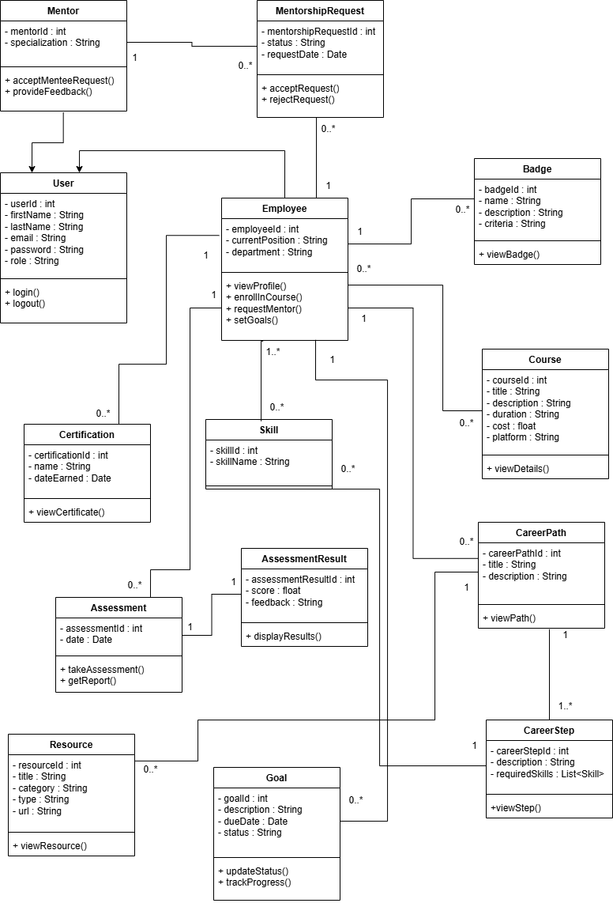

## 📌 Jira Planification  
🔗 [Accéder au backlog Jira](https://khadja-ourraiss.atlassian.net/jira/software/projects/CPW/boards/20/backlog?atlOrigin=eyJpIjoiY2ViNTc4YmJjODIyNGJhYzhhMGViOWQxNDFlMjU0OTciLCJwIjoiaiJ9)  

## 📂 UML Class Diagram  
🖼️ [Voir le diagramme UML dans drawio](https://drive.google.com/file/d/136YjdoE2QA3aa39QYP999r8cv9Hkr0BO/view?usp=sharing)



# 🚀 Employee Career Development & Training Platform

 <!-- Replace with your banner image -->

A comprehensive platform for employee skill development, career path planning, and mentorship management. Built with **Spring Boot** (Backend) and **Angular** (Frontend).

[]()
[]()
[]()
[]()
[]()

---

## 🌟 Key Features

### 📊 Skill Assessment & Analysis
- Interactive skill evaluation quizzes
- Detailed competency gap reports
- Industry benchmark comparisons

### 🎓 Personalized Training
- AI-driven course recommendations
- Integration with Udemy/Coursera/LinkedIn Learning
- Progress tracking dashboard

### 🛤️ Career Path Planning
- Customizable career roadmaps
- Skill/certification requirements visualization
- Milestone achievement alerts

### 👥 Mentorship System
- Mentor-employee matching algorithm
- In-app messaging and video calls
- Feedback-driven mentorship reviews

### 🏆 Recognition System
- Automated digital certifications
- Badge-based reward system
- Leaderboard for top performers

---

## 🛠️ Tech Stack

**Backend**

Spring Boot 3 | REST API Development

Spring Security | Authentication & Authorization

PostgreSQL | Relational Database

JPA/Hibernate | ORM

JWT | Secure Token Management

**Frontend**

Angular 15 | UI Framework

RxJS | State Management

PrimeNG | UI Component Library

Chart.js | Data Visualization

**DevOps**  

Docker | Containerization

Jenkins | CI/CD Pipeline

AWS EC2 | Cloud Hosting

---

## 🚀 Getting Started

### Prerequisites
- Java 17+
- Node.js 16+
- PostgreSQL 15+
- Maven 3.8+

### Installation

**Backend Setup**
```bash
git clone https://github.com/Khadija2504/CareerPathway
cd CareerPathway

# Build and run
mvn clean install
mvn spring-boot:run
```
**Frontend Steps**

```bash
git clone https://github.com/Khadija2504/CareerPathwayAngular
cd CareerPathway

# Install dependencies
npm install

# Start development server
ng serve
```